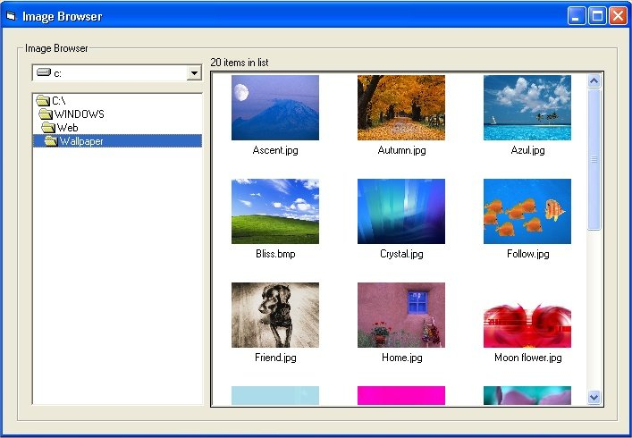



## ImageBrowser

### Description

Effortlessly browse through image files in directories with thumbnails being displayed for each picture in the directory. The thumbnails are put into a listview and the file name's are included.
 
### More Info
 

             |
---                |---
**Submitted On**   |2002-01-21 22:32:48
**By**             |[Adam\. A\. Black](https://github.com/Planet-Source-Code/PSCIndex/blob/master/ByAuthor/adam-a-black.md)
**Level**          |Intermediate
**User Rating**    |4.6 (65 globes from 14 users)
**Compatibility**  |VB 6\.0
**Category**       |[Miscellaneous](https://github.com/Planet-Source-Code/PSCIndex/blob/master/ByCategory/miscellaneous__1-1.md)
**World**          |[Visual Basic](https://github.com/Planet-Source-Code/PSCIndex/blob/master/ByWorld/visual-basic.md)
**Archive File**   |[ImageBrows502021212002\.zip](https://github.com/Planet-Source-Code/adam-a-black-imagebrowser__1-31026/archive/master.zip)

